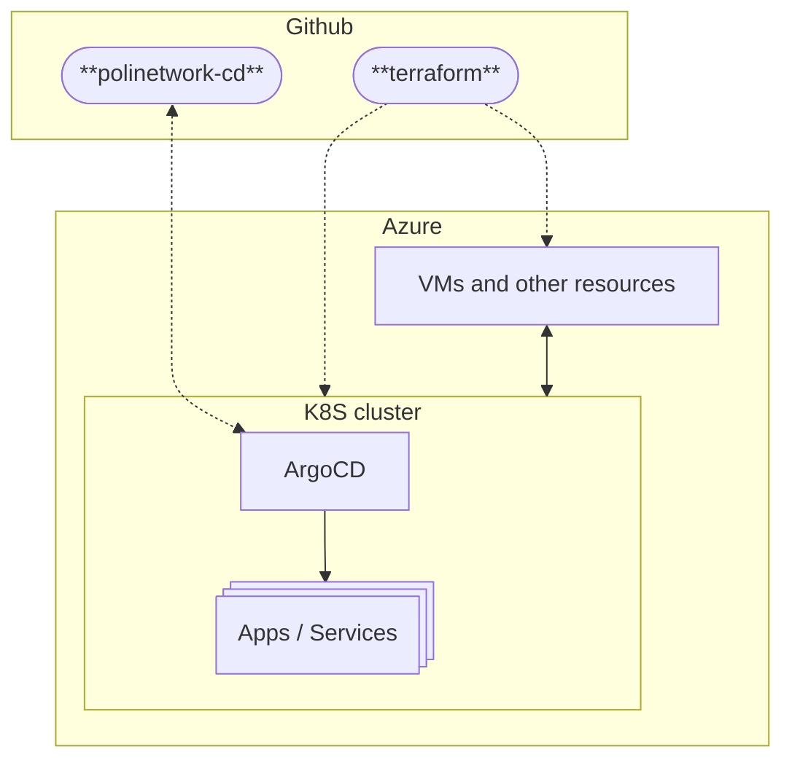

import DocCardList from '@theme/DocCardList';

## Overview

This section explains how we organized our infrastructure.

Everything regarding the deployment of apps and services is divided into two repositories:

- [polinetworkorg/terraform](https://github.com/polinetworkorg/terraform) - Contains the Terraform code to deploy the infrastructure. This defines the resources that are created on Azure, from specific things like KeyVaults, to the Kubernetes cluster itself.
- [polinetworkorg/polinetwork-cd](https://github.com/polinetworkorg/polinetwork-cd) - Our GitOps repo, contains the manifests that define deployments specific for each app or service. This repository is connected to the ArgoCD instance running on the Kubernetes cluster.

<!-- markdownlint-disable-next-line -->
<DocCardList />
