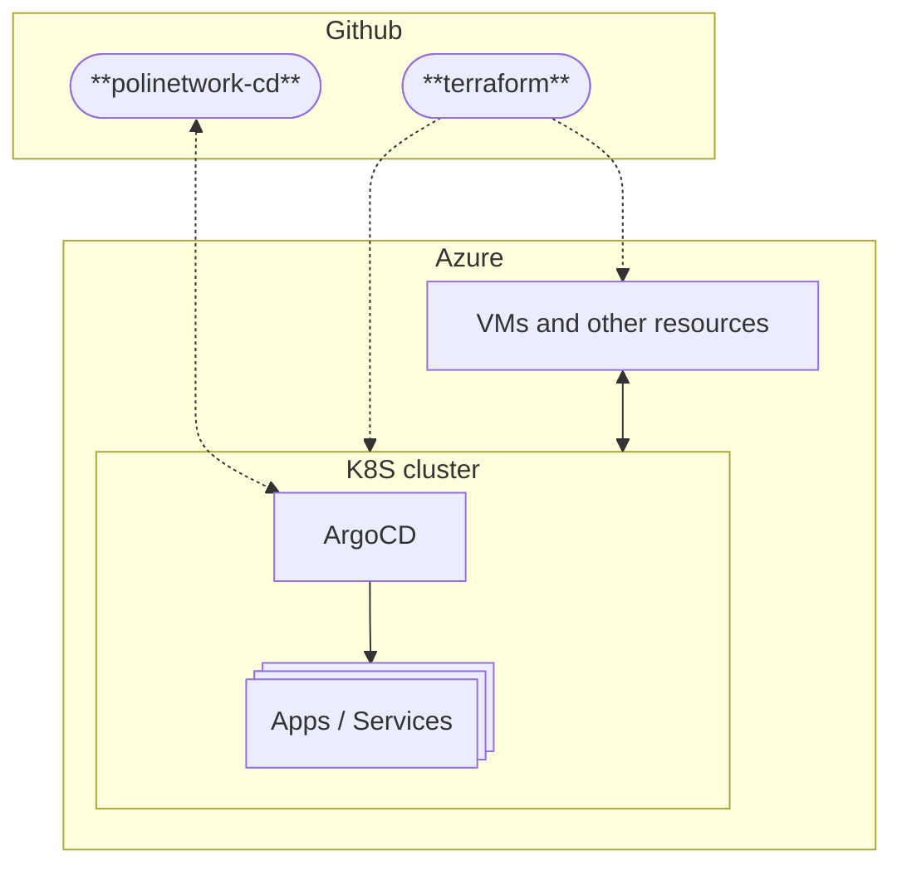

import DocCardList from '@theme/DocCardList';

## Overview

This section explains how we organized our infrastructure.

Everything regarding the deployment of apps and services is divided into two repositories:

- [polinetworkorg/terraform](https://github.com/polinetworkorg/terraform) - Contains the Terraform code to deploy the infrastructure. This defines the resources that are created on Azure, from specific things like KeyVaults, Disks, and VMs, to the Kubernetes cluster itself.
- [polinetworkorg/polinetwork-cd](https://github.com/polinetworkorg/polinetwork-cd) - Our GitOps repo, contains the manifests that define deployments specific for each app or service. This repository is connected to the ArgoCD instance running on the Kubernetes cluster.

### **Terraform: Definition and Purpose**  

The **Terraform** repository is responsible for managing and provisioning cloud infrastructure. In simple terms, it defines and creates the resources needed for the infrastructure, such as:  

- **Networks and subnets** (Virtual Networks, Subnets, Security Groups)
- **Virtual machines** (VMs, Containers, Kubernetes Clusters)
- **Databases** (MariaDB, PostgreSQL)
- **Storage** (Blob Storage, Virtual Disks, File Shares)
- **Security services** (Identity and Access Management, Firewalls)

The code in **Terraform** describes these resources declaratively: it defines the desired state, and Terraform applies the necessary changes to reach that state. This repository is primarily used to **create and modify the cloud infrastructure** where applications will run.

### **PoliNetwork-CD: Definition and Purpose**  

The **PoliNetwork-CD** (Continuous Deployment) repository, on the other hand, is dedicated to managing and updating applications once the infrastructure has been created. Specifically, it uses **GitOps** tools (in our case, **ArgoCD**, but **Flux** is also an opinionated option) to:  

- **Define application deployments** in Kubernetes (or Kustomize, Helm, etc.)
- **Automatically update applications** when code changes  
- **Manage application configurations** (e.g., configuration files, environment variables)  
- **Monitor the state of applications** and ensure they remain in sync with the repository  

While Terraform is responsible for infrastructure, **PoliNetwork-CD** focuses on **managing the lifecycle of applications** running on that infrastructure, ensuring that code changes are applied automatically and securely.  

### **Key Difference: Infrastructure vs. Deployment**

| Repository | Main Purpose | Example of Managed Resources |
|------------|--------------|------------------------------|
| **Terraform** | Creates and manages cloud infrastructure | Networks, VMs, databases, storage, security |
| **PoliNetwork-CD** | Automates application deployment and updates | Deployments, configurations, GitOps updates |

In summary, **Terraform builds the foundation on which applications run**, while **PoliNetwork-CD manages the deployment and continuous updating of applications**. Both repositories work together to ensure a scalable and efficient cloud infrastructure.

<!-- markdownlint-disable-next-line -->
<DocCardList />

## References

### **Links to Repositories**

- [Terraform Repository](https://github.com/polinetworkorg/terraform)
- [PoliNetwork-CD Repository](https://github.com/polinetworkorg/polinetwork-cd)

### **Additional Resources**

- [Kubernetes Documentation](https://kubernetes.io/docs/)
- [Terraform Documentation](https://www.terraform.io/docs/)
- [ArgoCD Documentation](https://argo-cd.readthedocs.io/en/stable/)
